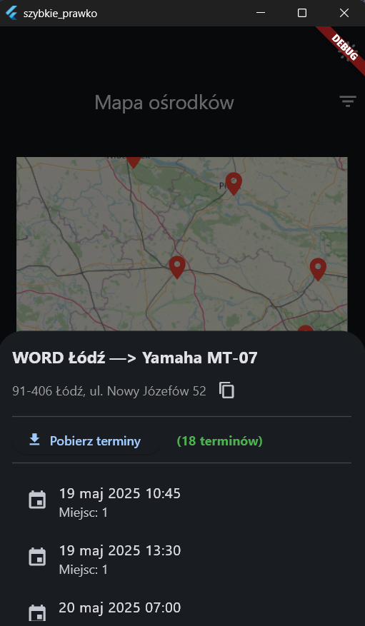

# SzybkiePrawko

<p align="center">
	<a href="https://flutter.dev">
		
	</a>
	<a href="https://dart.dev">
		
	</a>
	<a href="https://github.com/TwojRepo/LICENSE">
		
	</a>
</p>


SzybkiePrawko is a Flutter application that makes it easier to search for available dates for practical driving exams. It allows to view exam dates on a calendar, locate centers on a map and search multiple exam centers at once. It depends on `info-car.pl` website for data retrieval.

<div align="center">
	
</div>

## Prerequisites

- `Flutter SDK` (Channel stable, version 3.0 or higher)
- `Dart SDK` (included with Flutter)
- `Android SDK` (with an emulator or a connected device)
- `VS Code` (optional) with the Flutter and Dart extensions installed

## Getting Started

1. Clone the repository
	```bash
	git clone <your-repo-url>
	cd <project-folder>
	```

2. Install dependencies
	```bash
	flutter pub get
	``` 

## Running in Debug Mode (Windows)

```bash
flutter run -d windows \
	--dart-define=LOGIN='<InfoCar.pl-login>' \
	--dart-define=PASSWORD='<InfoCar.pl-password>'
```

## Building a Release APK

```bash
flutter build apk --release \
	--dart-define=LOGIN='<InfoCar.pl-login>' \
	--dart-define=PASSWORD='<InfoCar.pl-password>'
```
Once the build completes, the APK will be located at: `build/app/outputs/flutter-apk/app-release.apk`.

## Project Structure

```
lib/
├── main.dart		# Application entrypoint
├── global.dart		# Global variables & session state
├── models.dart		# Data models (Word, ExamEvent, WordMoto)
├── screens/
│	├── search_param.dart	# Search & filter UI
│	├── calendar.dart		# Calendar view of exam dates
│	└── word_map.dart		# Map with markers & BottomSheet
└── services/
	└── api_service.dart	# HTTP interactions & data fetching
assets/
└── moto.json		# Preloaded JSON data for vehicle models
```